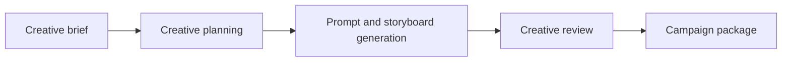

# Creative AI Lab

> A local-first, open-source lab for designing repeatable AI-assisted creative production workflows.


Creative AI Lab explores how a small creative team can turn a brief into consistent, well-documented campaign outputs using local LLMs, automation, and focused agentic workflows. It is intentionally built in public: decisions, experiments, and lessons learned are captured as the platform evolves.

## What it will do

The initial product flow is deliberately small:



Planned capabilities include:

- Turn creative briefs into campaign concepts, messaging, and visual direction.
- Produce reusable prompts for image, video, copy, and presentation tools.
- Generate structured storyboards and shot lists.
- Keep briefs, prompt versions, workflow history, and asset metadata in one place.
- Automate repeatable handoffs with n8n.

## Principles

- **Creative workflow first:** agents support the production lifecycle; they are not the product by themselves.
- **Local-first and open-source:** avoid paid runtime dependencies where practical.
- **Hardware-conscious:** designed for a 16 GB RAM laptop; start only the services needed for the task.
- **Modular:** individual tools and models can be replaced without redesigning the entire project.
- **Reproducible:** configuration and decisions are version controlled.

## v0.1 stack

| Layer              | Tool               | Role                                           |
| ------------------ | ------------------ | ---------------------------------------------- |
| Containers         | Docker Compose     | Repeatable local environment                   |
| Local LLM runtime  | Ollama             | Runs the selected local model                  |
| LLM interface      | Open WebUI         | Local chat and prompt testing                  |
| Automation         | n8n                | Creative workflow orchestration                |
| Database           | PostgreSQL         | Briefs, prompts, assets, and workflow metadata |
| Database UI        | Adminer            | Lightweight development database access        |
| Agent application  | Python + LangGraph | Planned creative workflow logic                |
| Optional analytics | Metabase           | Start only when reporting is needed            |

The recommended starting model is **Gemma 2 2B Instruct** because it offers a practical quality/resource balance for this laptop class. The model is not bundled with the Compose stack; pull it after Ollama starts.

## Quick start

### Prerequisites

- Docker Desktop with Compose
- 16 GB RAM recommended
- At least 10 GB free disk space for containers, volumes, and one local model

### Start the core services

```powershell
Copy-Item .env.example .env
docker compose up -d
```

Open the local services:

| Service    | Address                |
| ---------- | ---------------------- |
| Open WebUI | http://localhost:3000  |
| n8n        | http://localhost:5679  |
| Adminer    | http://localhost:8080  |
| Ollama API | http://localhost:11434 |
| PostgreSQL | localhost:5433         |

Pull the model when the Ollama container is healthy:

```powershell
docker compose exec ollama ollama pull gemma2:2b
```

Then add `http://ollama:11434` as the Ollama connection in Open WebUI (the default Compose configuration supplies this automatically for a fresh setup). If you open n8n in a browser, use `http://localhost:5679`.

For setup details, resource-saving tips, and troubleshooting, see [docs/INSTALLATION.md](docs/INSTALLATION.md).

## Resource-aware use

Do not treat all services as always-on. For day-to-day prompt work, run Ollama and Open WebUI. Start n8n only while building or demonstrating an automation. Adminer is for database inspection. Metabase is intentionally optional because it has a larger memory footprint.

```powershell
# Stop services not in use while keeping their data volumes
docker compose stop n8n adminer open-webui
```

## Project status

This is an active work in progress. v0.1 establishes the local platform and documentation, not a finished creative application.

- [x] Define local-first architecture and constraints
- [x] Add core Docker Compose stack
- [x] Document initial roadmap and decisions
- [ ] Validate Gemma with Open WebUI
- [ ] Create the Creative Brief workflow
- [ ] Add prompt-library persistence
- [ ] Build the first end-to-end campaign demo

## Documentation

- [Architecture](docs/ARCHITECTURE.md)
- [Roadmap](docs/ROADMAP.md)
- [Architecture decisions](docs/DECISIONS.md)
- [Installation](docs/INSTALLATION.md)
- [Development guide](docs/DEVELOPMENT.md)
- [Agent design](docs/AGENT_DESIGN.md)
- [Prompt guide](docs/PROMPT_GUIDE.md)
- [Changelog](docs/CHANGELOG.md)
- [Learning journal](LEARNING_JOURNAL.md)

## Planned structure

```text
Creative-AI-Lab/
├── app/                 # Python workflows, agents, prompts, and integrations
├── campaigns/           # Complete creative campaign case studies
├── data/                # Local briefs and non-sensitive reference material
├── database/            # Schema, migrations, and seed data
├── docs/                # Project documentation
├── scripts/             # Setup and operational helpers
├── tests/               # Automated checks
├── docker-compose.yml
└── README.md
```

Directories are added as features need them; v0.1 avoids empty scaffolding.

## License

MIT. Add a `LICENSE` file before publishing the repository.
