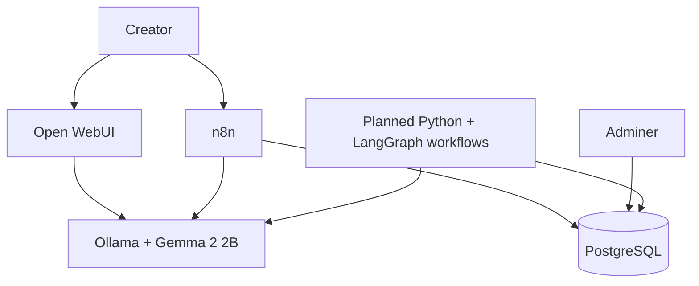
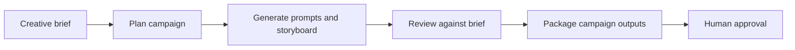

# Architecture

## Purpose

Creative AI Lab is a local-first foundation for creative production workflows. Its first objective is to make planning, prompting, review, and delivery repeatable—not to run a large autonomous multi-agent system.

## v0.1 runtime architecture

| Component | Responsibility | Run when |
| --- | --- | --- |
| PostgreSQL | Stores future creative briefs, prompts, assets, and workflow records | Core development |
| Adminer | Lightweight database inspection | Database work only |
| Ollama | Serves one local LLM | Prompting or workflows |
| Open WebUI | Prompt testing and local chat | Prompting or demos |
| n8n | Visual automation and handoffs | Workflow development or demos |
| Python + LangGraph | Future deterministic workflow and tool orchestration | Added in v0.2 |

## Creative production flow

Human approval remains explicit. Generated content is a draft until reviewed for brand, factual, legal, and cultural fit.

## Data ownership

- Docker named volumes persist service data outside containers.
- PostgreSQL will hold structured project metadata, not raw large media files.
- Generated assets should be stored locally under ignored directories or in an external asset store when one is added.
- Never commit campaign source material, credentials, or proprietary brand guidelines.

## Resource strategy

This stack is intentionally limited to five lightweight services. On a 16 GB laptop, avoid operating every service continuously. Open WebUI and Ollama are enough for prompt work; start n8n and Adminer only when needed. Metabase is deferred and will be an optional Compose profile if reporting becomes a real requirement.

## Future boundary

Image, video, voice, browser, and cloud integrations are not v0.1 dependencies. They will be introduced only after the text-based creative brief workflow is reliable and documented.
